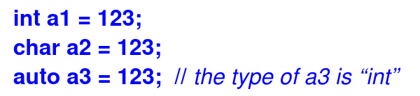
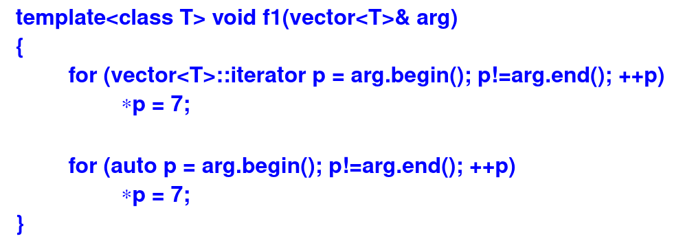
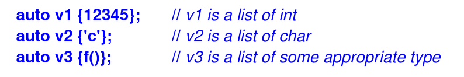
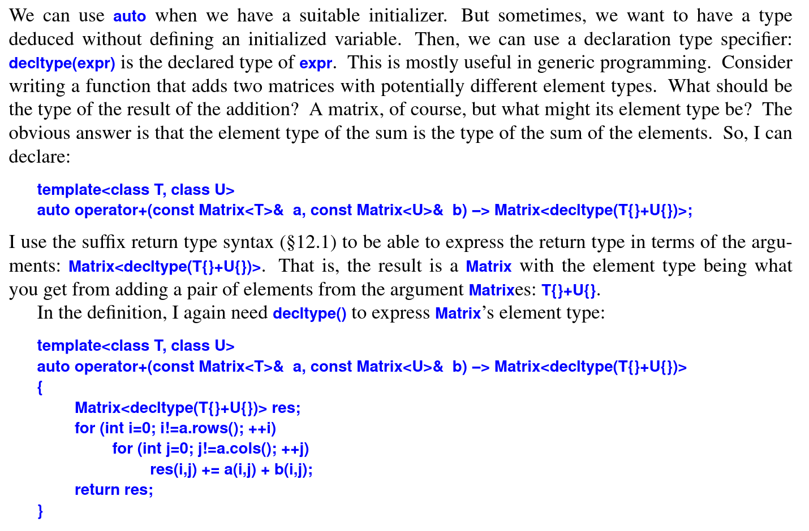

The language provides two mechanisms for deducing a type from an expression:
- **auto** for deducing a type of an object from its initializer; the type can be the type of a variable, a **const**, or a **constexpt**
- **dectype(expr)** for deducing the type of something that is not a simple initializerm such as the return type for a function or the type of a class member
- **auto** and **dectype()** report the type of an expression already known to the compiler

The **auto** type specifier:
- When a declaration of a variable has an initializer, we don’t need to explicitly specify a type. Instead, we can let the variable have the type of its initializer

<i>Figure 1: using auto
</i>

- The type of the integer literal 123 is int, so a3 is an int. That is, auto is a placeholder for the type of the initializer
- There is not much advantage in using **auto** instead of **int** for an expression as simple as 123. The harder the type is to write and the harder the type is to know, the more useful auto becomes. For example:

<i>Figure 2: auto worth use
</i>

- The loop using **auto** is the more convenient to write and the easier to read. Also, it is more resilient to code changes.  For example, if I changed arg to be a list, the loop using auto would still work correctly whereas the first loop would need to be rewritten
- Unless there is a good reason not to, use **auto** in small scopes
- It can be an advantage to use the = syntax with auto, because the {}-list syntax might surprise someone

<i>Figure 3: trap using auto
</i>

- Using **=** rather than **{}** for objects specified auto whenever we don’t
mean "list"

The **decltype()** specifier:

<i>Figure 4: decltype Specifier
</i>