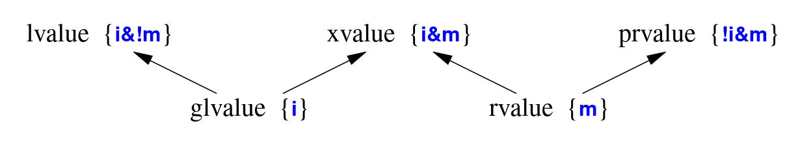

- An _object_ is a contiguous region of storage; an _lvalue_ is an expression that refers to an object
- The word "lvalue" was originall coined to mean "something that can be on the left-hand side of an assignment"
- _rvalue_ means "a value that is not an lvalue", such as a temporary value (e.g., the value returned by a function)
- There are two properties that matter for an object when it comes to addressing, copying, and moving:
  - Has identity: The program has the name of, pointer to, or reference to the object so that it is possible to determine if two objects are the same, whether the value of the object has changed, etc
  - Movable: The object may be moved from (i.e., we are allowed to move its value to another location and leave the object in a valid but unspecified state, rather than copying;)
- Using "m for movable" and "i for has identity", we have the classification of expressions graphically:

<i>Figure 1: Classification of expression
</i> 

- A classical lvalue is something that has identity and cannot be moved (because we could examine it after a move)
- A classical rvalue is anything that we are allowed to move from
- Note that every expression is either an lvaue or an rvalue, but not both