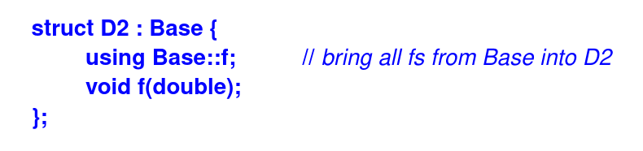
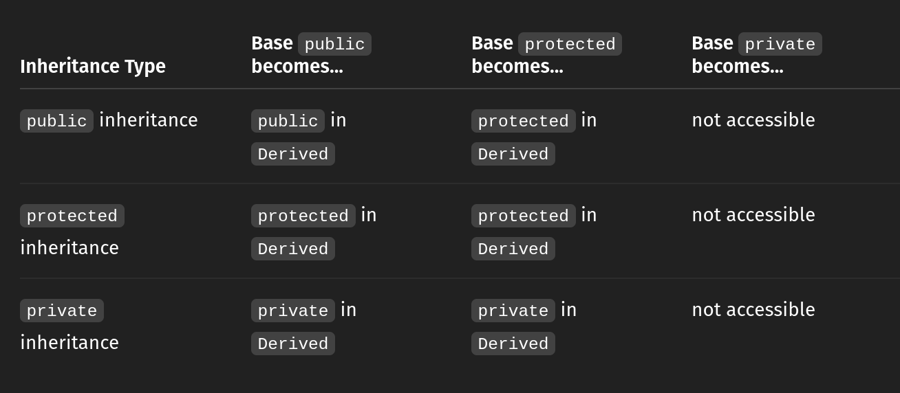

- The notion of a derived class and its associated language mechanisms are provided to express hierarchical relationships, that is, to express commonality between classes
- For example, the concepts of a circle and a triangle are related in that they are both shapes; that is, they have the concept of a shape in common. Thus, we explicitly define class **Circle** and class **Triangle** to have class **Shape** in common. In that case, the common class, here **Shape**, is referred to as the _base_ class or _superclass_ and classes derived from that, here **Circle** and **Triangle**, are referred to as _derived_ classes or _subclasses_
- The language features support building new classes from existing ones:
  - _Implementation inheritance_: to save implementation effort by sharing facilities provided by a base class
  - _Interface inheritance_: to allow different derived classes to be used interchangeably through the interface provided by a common base class
  - Interface inheritance is often referred to as _run-time polymorphism_ (or _dynamic polymorphism_)
  - In contrast, the uniform use of classes not related by inheritance provided by templates is often referred to as _complie-time polymorphism_ (or _static polymorphism_)
- Derivation is often represented graphically by a pointer from the dreived class to its base class indicating that the derived class refers to its base
  
  
  
<i>Figure 1: Derivation Represented Graphically
<i>
   

- A derived class is often said to inherit properties from its base, so the relationship is also called _inheritance_
- A popular and efficient implementation of the notion of derived classes has an object of the derived class represented as an object of the base class, with the information belonging specifically to the derived class added at the end
  
  
Figure 2: Employee Manager implementation 
</i>
   

- A **Manager** is (also) an **Employee**, so a **Manager*** can be used as an **Employee***. However, an **Employee** is not necessarily a **Manager**, so an **Employee** cannot be used as a **Manager***
- In general, if a class **Derived** has a public base class **Base**, then a **Derived∗** can be assigned to a variable of type **Base∗** without the use of explicit type conversion. The opposite conversion, from **Base∗** to **Derived∗**, must be explicit
  
  
Figure 3: Using derived and base class pointer 
</i>
   

- In other words, an object of a derived class can be treated as an object of its base class when manipulated through pointers and references. The opposite is not true
- To use derived classes as more than a convenient shorthand in declarations (it's mean that using Base* only to hold derived objects - but **not really using polymorpism properly** yet), we must solve the following problem: Given a pointer of type **Base***, to which derived type dose the object pointed to really belong? There are four fundamental solytions:
  - Ensure that only objects of a single type are pointed to
  - Place a type field in the base class for the functions to inspect
  - Use **dynamic_cast**
  - Use virtual functions
- Virtual funtions:
  -  Virtual functions overcome the problems with type-field solution by allowing the programmer to declare functions in a base class that can be redefined in each derived class
  -  The compiler and linker will guarantee the correct correspondence between objects and the functions applied to them
  -  A function from a derived class with the same name and the same set of argument types as a virtual function in a base is said to _override_ the base class version of the virtual function
  -  Getting "the right" behavior from Base's functions independently of exactly what kind of Base is actually used is called _polymorphism_
  -  To get runtime polymorphic behavior in C++, the member functions called must be **virtual** and objects must be manipulated through pointers or references 
  -  To implement polymorphism, compiler use _the virtual function table_ (**vtable**) and _virtual pointer_ (**vptr**):
     -  The virtual function table:
        -  A hidden table of function pointers
        -  Each class with virtual functions has **its own vtable**
        -  One entry per virtual function (order matches bass declaration)
     - Virtual pointer (vptr):
       - Every object of a class with virtual functions gets a hidden pointer called vptr
       - This **vptr** points to the **vtable** of the object's **actual type**
     - Calling a Virtual Funtion: when call a virtual ptr->funct(), the compiler:
       - Follows **vptr** to the **vtable**
       - Looks up the funtion pointer (by index)
       - Calls the correct override (based on the actual class) 
  
  
<i>Figure 4: Graphically represent of vtable and vptr
</i>
   
- Override Control:
  - **virtual**: The function may be overriden
  - **=0**: The function must be virtual and must be overridden
  - **override**: The function is meant to override a virtual function in a base class
  - **final**: The function is not meant to be overriden
  - In the absence of any of these controls, a non-static member function is virtual if and only if it overrides a virtual function in a base class
- using Base Members:
  - Functions do not overload across scopes, it's mean:
    - When we declare any function in the derived class that has the same name as a function in the base class, the base class function are hidden. This is called name hiding
    
    
<i>Figure 5: Name hidden
</i>
     
    
    - To "bring back" the base class function into the derived class scope, we can use a **using** declaration:
    
    
<i>Figure 6: Using base member
</i>
      
    
    - Now "**d.f(1)**; // call D2::f(int), that is, Base::f(int)"
- Abstract class:
  - Abstract class is the class with one or more the pure virtual function (a virtual function is "made pure" by the "psueudo initializer" **=0**) in declaration
  - No objects of abstract class can be created
  - An abstract class is intended as an interface to objecs accessed thorough pointers and references (to preserve polymorphic behavior)
  - An abastract class provides an interface without exposing implementation details. For example, an operating system might hide the details of its device drivers behind an abstract class:
  
  
<i>Figure 7: Abstract class device driver
</i>
    

  - We can then specify drivers as classes derived from **Character_device** and manipulate a variety of drivers through that interface
  - The design style supported by abstract classes is called _interface inheritance_ in constrast to the _implementation inheritance_ supported by base classes with state and/or defined member function
- Access Control: A member of a class can be **private**, **protected**, or **public**:
  - If it is **private**, its name can be used only by member functions and friends of the class in which it is declared
  - If it is **proteced**, its name can be used only by member functions and friends of the class in which it is declared and by member function and friends of classes derived from this class
  - If it is **public**, its name can be used by any function
  - This reflects the view that there are three kinds of functions accessing a class: functions implementing the class (its friends and members), functions implementing a derived class (the derived class's friends and members), and other functions
  
  
<i>Figure 8: Access control
</i>
    

- Access to Base Classes: Like a member, a base class can be declared **private**, **protected**, or **public**:
  
  
<i>Figure 9: Access to Base Classes
</i>
    
  
  - When write code: "class Derived : public Base { };" we are not controlling: acess to members inside **Derived** itself (like **public** or **private** in a class body), instead of we are controlling: how the members of **_Base_** are inherited by **Derived** - and what outside code can access them though **Derived** 
  
  
<i>Figure 10: Inheritance mode in C++
</i>
   
  - Public inheritance = "I am a Base. Treat me like one"
  - Protected inheritance = "I use Base internally, but you can not access it from the outside"
  - Privated Inheritance = "I use Base purely as an implementation detail"