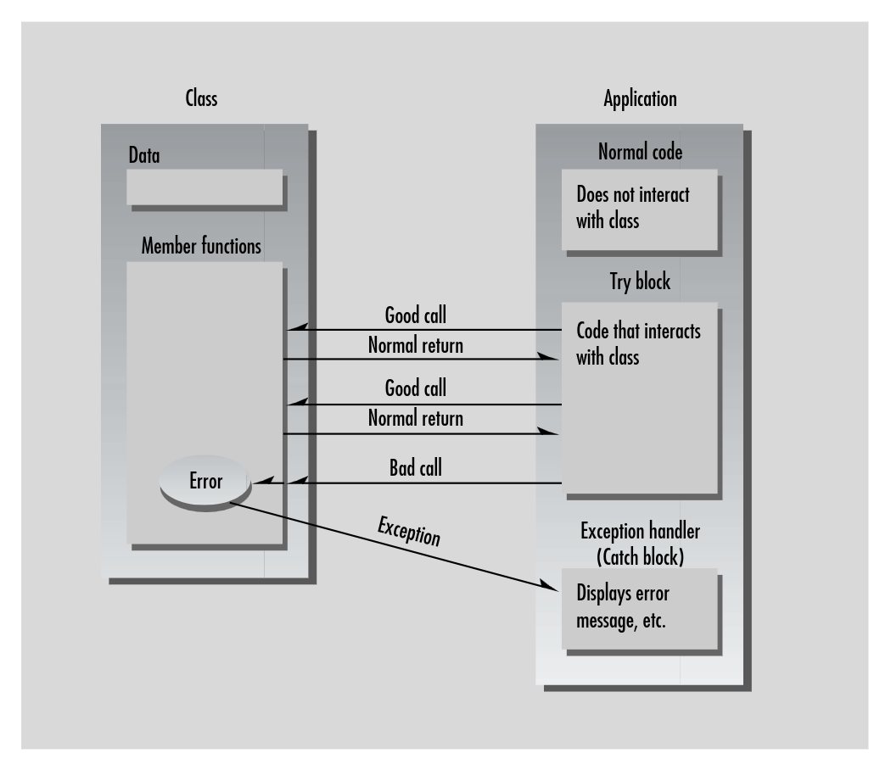

**Why Do We Need Exceptions?**
- C-language programs often signal an error by returning a particular value from the function in which it occurred. For example:
  ```cpp
  if( somefunc() == ERROR_RETURN_VALUE )
    //handle the error or call error-handler function
  else
    //proceed normally
  if( anotherfunc() == NULL )
    //handle the error or call error-handler function
  else
    //proceed normally
  if( thirdfunc() == 0 )
    //handle the error or call error-handler function
  else
    //proceed normally
  ```
- The problem with this approach is that every single call to such a function must be examined by the program. Surrounding each function call with an _if...else_ statement, and adding statements to handle the error (or call an error-handler routine), require a lot of code and makes the listing convoluted and hard to read
- The problem becomes more complex when classes are used, since errors may take place with-out a function being explicitly called. Like: how will the application find out if an error occurred in the class construtor? The constructor is called implicitly, so there's no return value to be checked
- Things are complicated even further when an application uses class libraries. A class library and the application that makes use of it are often created by separate people: the class library by a vendor and the application by a programmer who buys the class library. This makes it
even harder to arrange for error values to be communicated from a class member function to the program that’s calling the function. The problem of communicating errors from deep within class libraries is probably the most important problem solved by exceptions

**Exception Syntax**
- Imagine an application that creates and interacts with objects of a certain class. The application makes a mistake, causing an error to be detected in a member function:
  - Member function will _throw_ an exception
  - In the application, we will install a separate of code to handle error. This code is called an _exception handler_ or _catch block_; it _catches_ the exceptions thrown by member function
  - Any code in the application that uses objects of the class is enclosed in a _try block_. Errors generated in the try block will be caught in the catch block
  - Code that doesn't interact with the class need no be in a try block 
    
    <p align="center"><i>Figure 1: The exception mechanism</p></i>
- The exception mechanism uses three new C++ keywords: _throw_, _catch_ and _try_
- Also, we need to create a new kind of enity called an exception class. For example:
  ```cpp
   class AClass
   {
        public:
        class AnError // exception class
        {
        };
        void Func() // member fucntion
        {
            if(/* error condition */)
                throw AnError(); // throw exception        
        }
   };

   int main() // application
   {
        try // try block
        {
            AClass obj;
            obj.Func();
        }
        catch (AClass::AnError) // catch block
        {
            // tell user about error, etc
        }
        return 0;
   }
   ```
- Sequence of events when an exception occurs:
  - Code is executing normally outside a try block
  - Control enters the try block
  - A statement in the try block causes an error in a member function
  - The member function throws an exception 
  - Control transfers to the exception handler (catch block) following the try block
  - Control passes to the statement following all the catch blocks