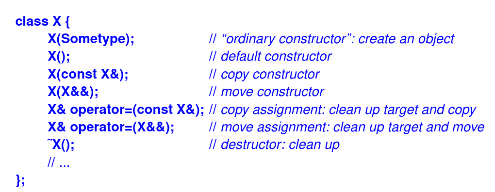
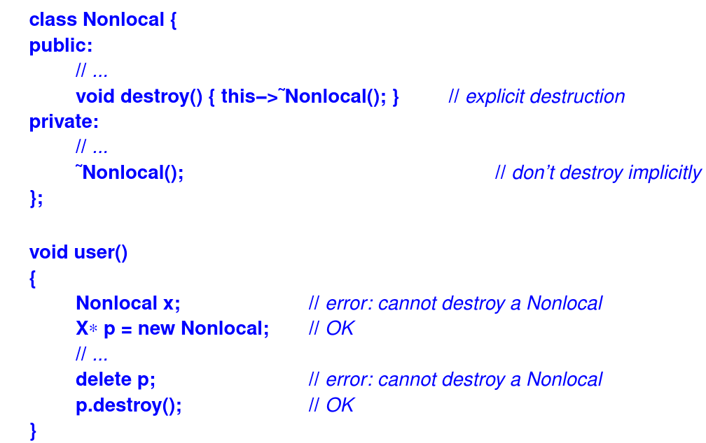
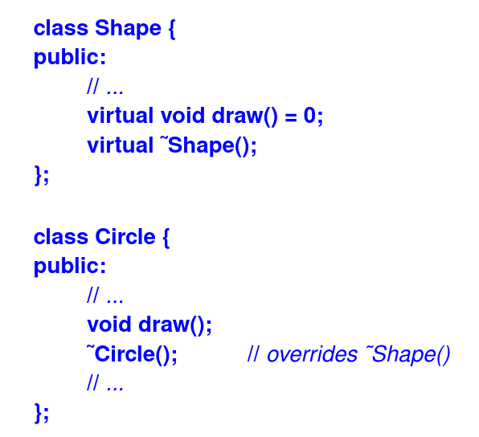
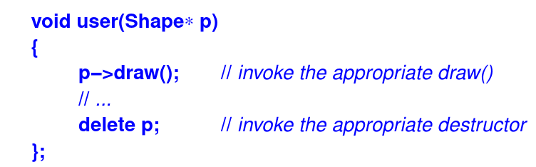
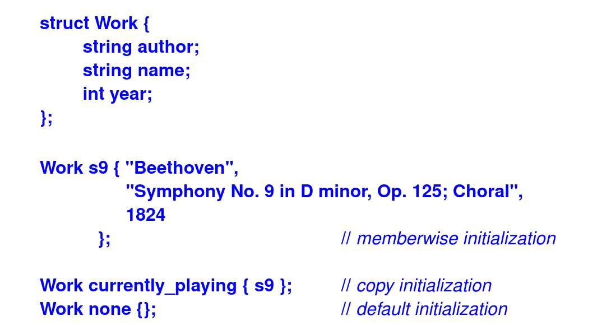
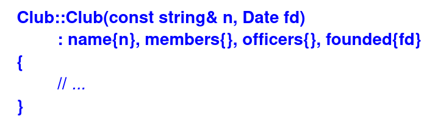
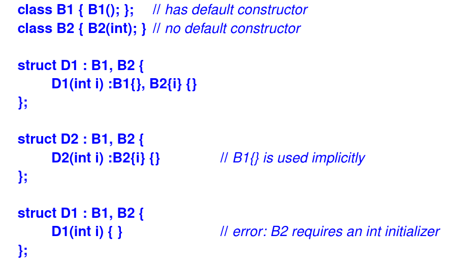

- The difference between _move_ and _copy_ is that after a copy two objects must have the same value, whereas after a move the source of the move is not required to have its original value
- Moves can be used when the source object will not be used again
- An object is considered an object of its type after its constructor completes, and it remains an object of its type until its destructor starts executing
  
  
  
<i>Figure 1: Class life cycle syntax 
</i>
  
- There are five situations in which an object is copied or moved:
  - As the source of an assignment
  - As an object initializer
  - As a function argument
  - As a function return value
  - As an exception
- The style of constructor/destructor-based resource management is called _Resource Acquisition Is Initialization_ or simply RAII
- Constructors and destructors interact correctly with class hierarchies:
  - Constructor: base → member → derived
  - Destructor: derived → member → base
- **Member objects** are always contructed in **the order they are declared**, not the order in the initializer list
- A destructor is invoked implicitly upon exit from a scope or by **delete**. This implies that we can prevent destruction of a class by declaring its destructor **=delete** or **private**
  
  
  
<i>Figure 2: Prevent implicit class destruction
</i>
  
- **virtual** Destructors:
  - A destructor can be declared to be virtual, and usually should be for a class with a virtual function
   
    
    
<i>Figure 3: virtual destructor
</i>
  
  - The reason we need a **virtual** destructor is that an object usually manipulated through the interface provided by a base class is often also deleted through that interface
   
    
    
<i>Figure 4: virtual destructor using
</i>
  
- Class Object Initialization:
  - Initialization without constructors: we can initialize objects of a class for which we have not definede a constructor using:
    - memberwise Initialization
    - copy initialization
    - default initialization (without an initializer or with an empty initializer list)
  
    
    
<i>Figure 5: Initialization Without Constructors </i>
    

  
  - The tree member of **currently_playing** are copies of those **s9**
  - The default initialization of using **{}** is defined as initialization of each member by **{}**. So, none
  is initialized to **{{},{},{}}**, which is **{"","",0}**
  - Where no constructor requiring arguments is declared, it is also possible to leave out the initializer completely
  (not use **{}** when define a object of class). For statically allocated objects the rules are exactly as when we had used **{}**. 
  But, for local variables, the default initialization is done only for members of class type, and member of built-in type
  are left unitializerd. So to guranteed initialization or simply dislike surprises, supply an initializer, such as **{}**
  - Member initialization: Arguments for a member's constructor are specified in a _member initializer list_ in the definition of the constructor of the containing class
  
    
    
<i>Figure 6: Member Initialization
</i>

  - Base initializer: Base of a derived class are initialized in the same way non-data members are.
  That is, if a base requires an initializer, it must be provided as a base initializer in a constructor
   
    
    
<i>Figure 7: Base Initialize
</i>

  - Some of initialize concepts can be reference when needed: **Delegating Constructors**, **In-Class Initializer**, **static Member Initialization**
- Copy and Move:
  - _Copy_ is the conventional meaning of **x=y**; that is, the effect is that the values of **x** and **y** are both equal to **y**'s value before the assignment
  - _Move_ leaves **x** with **y**'s former value and **y** with some _moved-from state_. For the most intersting cases, containers, that moved-from state is "empty"
  - Typically, a move cannot throw, whereas a copy might (because it may need to acquire a resource), and a move is often more efficient than a copy
  - When write a move operation, we should leave the source object in a valid but unspecified state beacuse it will eventually be destroyed and the destructor cannot destroy an object left in an invalid state
  - So, design the moves to to throw, and to leave the source objects in a state that allows destruction and assignment  
- Copy:
  - Copy for a class X is defined by two operations:
    - Copy constructor: **X(const X&)**
    - Copy assignment: **X& operator=(const X&)**