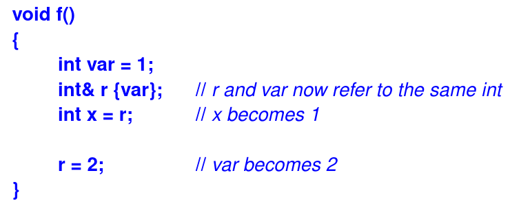
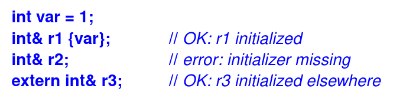
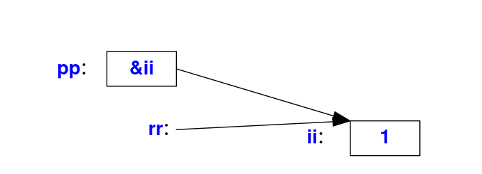
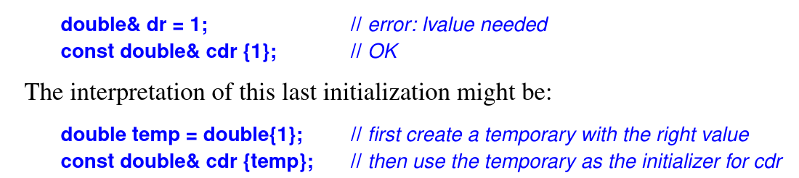

- A pointer allow to pass potentially large amounts of data around at low cost: instead of copying the data we simply pass its address as a pointer value
- The type of the pointer determines what can be done to the data through the pointer
- Using a pointer differs from using the name of an object in a few ways:
  - We use a different syntax, for example, ∗p instead of obj and p−>m rather than obj.m
  - We can make a pointer point to different objects at different times
  - We must be more careful when using pointers than when using an object directly: a pointer may be a nullptr or point to an object that wasn’t the one we expected
- These differences can be annoying; for example, some programmers find f(&x) ugly compared to f(x)
- Worse, managing pointer variables with varying values and protecting code against the possibility of nullptr can be a significant burden
- Finally, when we want to overload an operator, say +, we want to write x+y rather than &x+&y
- The language mechanism addressing these problem is called a _reference_
- Like a pointer, a reference is an alias for an object, is usually implemented to hold a machine address of an object, and does not impose performance overhead compared to pointers, but it differs from a pointer in that:
  - You access the reference with exactly the same syntax as the name of an object
  - A reference always refers to the object to which it was initialized
  - There is no "null reference", and we may assume that a reference refers to an object
- The main use of references is for specifying arguments and return values for functions in general and for overloaded operators in particular
- To reflect the lvalue/rvalue and const/non-const distinctions, there are three kinds of references:
  - _lvalue reference_: to refer to objects whose value we want to change
  - const reference: to refer to objects whose value we do not want to change (e.g., a constant)
  - rvalue reference: to refer to objects whose value we do not need to preserve after we have used it (e.g., a temporary)
- Collectively, they are called _references_. The first two are both called _lvalue references_
- lvalue references:
  - In a type name, the notation X& means ‘‘reference to X.’’ It is used for references to lvalues, so it is often called an _lvalue reference_
  
  <p align="center"><i>Figure 1: lvalue reference </p></i> 

  - To ensure that a reference is a name for something (that is, that it is bound to an object), we must initialize the reference
  
  <p align="center"><i>Figure 2: lvalue reference initialize</p></i>

  - If we have a "int& rr{var};" ++rr does not increment the reference rr; rather, ++ is applied to the int to which rr refers, that is, to var. Consequently, the value of a reference cannot be changed after initialization; it always refers to the object it was initialized to denote. To get a pointer to the object denoted by a reference rr, we can write &rr
  - Thus, we cannot have a pointer to a reference. Furthermore, we cannot define an array of references
  - The obvious implementation of a reference is as a (constant) pointer that is dereferenced each time it is used. It doesn’t do much harm to think about references that way, as long as one remembers that a reference isn’t an object that can be manipulated the way a pointer is
  
  <p align="center"><i>Figure 3: pointer and reference</p></i>

  - In some cases, the compiler can optimize away a reference so that there is no object representing that reference at run time
  - Initialization of a reference is trivial when the initializer is an lvalue. The initializer for a ‘‘plain’’ T& must be an lvalue of type T
  - The initializer for a const T& need not be an lvalue or even of type T. In such cases:
    - First, implicit type conversion to T is applied if necessary
    - Then, the resulting value is placed in a temporary variable of type T
    - Finally, this temporary variable is used as the value of the initializer
    
    <p align="center"><i>Figure 4: Initialize a const lvalue reference</p></i>

  - References can also be used as return types. This is mostly used to define functions that can be used on both the left-hand and right-hand sides of an assignment
- rvalue references:
  - An rvalue reference refers to a temporary object, which the user of the reference can (and typically will) modify, assuming that the object will never be used again
  - We want to know if a reference refers to a temporary, because if it does, we can sometimes turn an expensive copy operation into a cheap move operation
  - The classic example is a return value where the compiler knows that a local variable returned will never again be used
  - An rvalue reference can bind to an rvalue, but not to an lvalue. For example:
    ```cpp
    string var {"Cambridge"}; 
    string f(); 
    
    string& r1 {var}; // lvalue reference, bind r1 to var (an lvalue) 
    string& r2 {f()}; // lvalue reference, error : f() is an rvalue 
    string& r3 {"Princeton"}; // lvalue reference, error: cannot bind to temporary
    string&& rr1 {f()}; // rvalue reference, fine: bind rr1 to rvalue (a temporary)
    string&& rr2 {var}; // rvalue reference, error : var is an lvalue
    string&& rr3 {"Oxford"}; // rr3 refers to a temporary holding "Oxford"
    
    const string cr1& {"Harvard"}; // OK: make temporary and bind to cr1
    ```
  - The **&&** declarator operator means "rvalue reference"
  - We do not use const rvalue references; most of the benefits from using rvalue references involve writing to the object to which it refer
  - Sometimes, a programmer knows that an object won't be used again, even though the compiler does not. Consider:
  
    ```cpp
    template<classT>
    swap(T& a, T &b) // "old-style swap"
    {
      T tmp{a}; // now we have two copies of a
      a = b;    // now we have two copies of b
      b = tmp;  // now we have two copies of tmp (aka a)
    }
    ```
  - If **T** is a type for which it can be expensive to copy elements, such as **string** and **vector**, this **swap()** becomes an expensive operation. Note something curious: we didn't want any copies at all; we just wanted to move the values of **a**, **b** and **tmp** around. We can tell that to the compiler:
    
    ```cpp
    template<classT>
    swap(T& a, T &b) // "perfect swap (almost)"
    {
      T tmp{static_cast<T&&>(a)}; // the initialization may write to a
      a = static_cast<T&&>(b);    // the assignment may write to b
      b = static_cast<T&&>(tmp);  // the assignment may write to tmp
    }
    ```
  - The result value of s**tatic_cast<T&&>(x)** is an rvalue of type **T&&** for **x**. An operation that is optimized for rvalues can now use its optimization for x. In particular, if a type **T** has a move constructor or a move assignment, it will be used
  - The use of **static_cast** in **swap()** is a bit verbose and slightly prone to mistyping, so the standard library provides a **move()** function: **move(x)** means **static_cast<X&&>(x)** where **X** is the type of **x**:
    ```cpp
    template<classT>
    swap(T& a, T &b) // "perfect swap (almost)"
    {
      T tmp{move(a)}; // move from a
      a = move(b);    // move from b
      b = move(tmp);  // move from tmp
    }
    ```