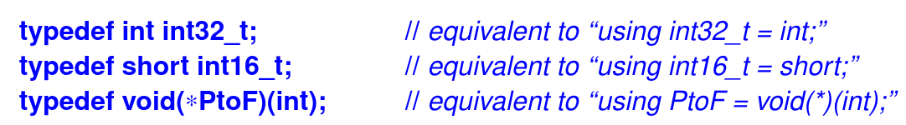

Sometimes, we need a new name for a type. Possible reasons include:
- The original name is too long, complicated, or ugly
- A programming technique requires different types to have the same name in a context
- A specific type is mentioned in one place only to simplify maintenance

    
    
<i>Figure 1: using keyword
</i>

- An older syntax using the keyword **typedef**. For example:

    
    
<i>Figure 2: typedef and using 
</i>

- Aliases are used when we want to isulate our code from details of the underlying machine. The name **int32_t** indicates that we want it to represent a 32-bit integer. Having written our code in terms of int32_t rather than "plain **int**", we can port out code to machint with **sizeof(int)==2** by redefining the single occurrence of int32_t in our code to use a long integer: **using int32_t = long**
- The **_t** suffix is conventional for aliases ("typedefs")