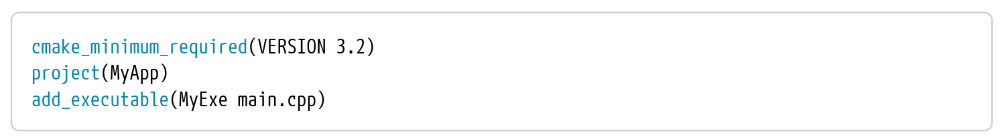
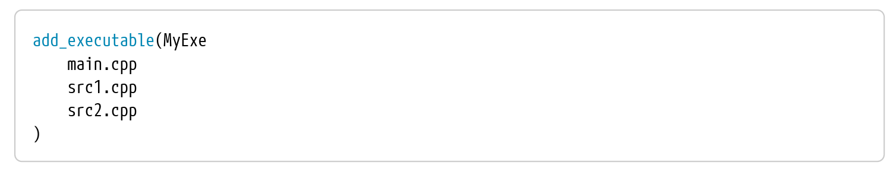
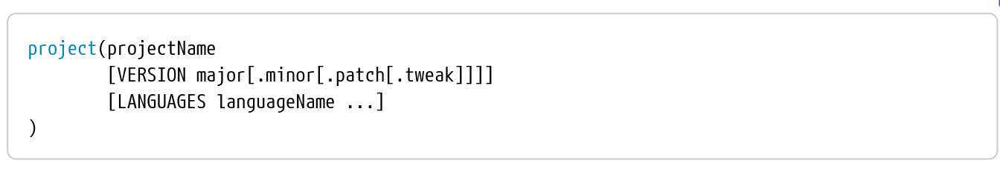
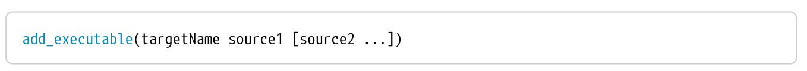
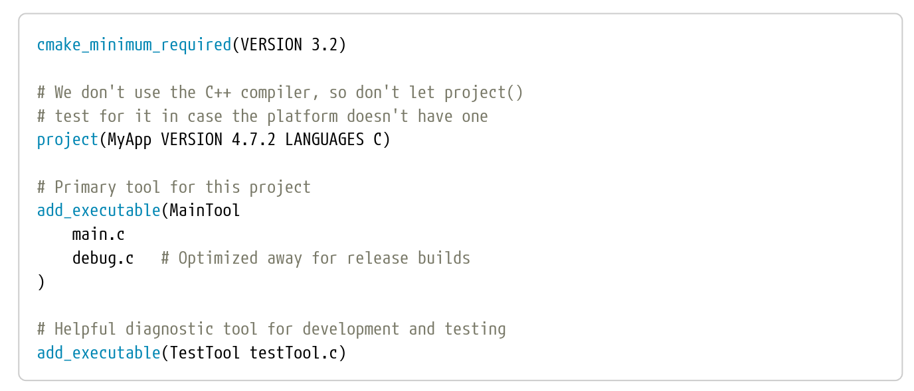

- All CMake project start with a file called _CMakeList.txt_ and it is expected to be placed at the **top of the source tree**
- It as the CMake project file, defining everything about the build from sources and targets through to testing, packaging and other custom tasks
- The following is a minial, well-formed _CMakeList.txt_ file producing a basic executable:
  
  
<i>Figure 1: Basic well formed CMakelist file
</i>
   
  
  - Each line in the above example executes a built-in CMake _command_
  - In CMake, commands are similar to other languages's function calls, except that while they support arguments, they do not return values directly. Arguments are separtated from each other by spaces and may be split across multiple lines:
  
  
<i>Figure 2: CMake Argument
</i>
   
   
   - Command names are **case insenstive**
- The _cmake_minimum_required()_ command does two things:
  - It specifies the minimum version of CMake the project needs. If the CMakeLists.txt file is processed with a CMake version older than the one specified, it will halt immediately with an error. This ensures that a particular minimum set of CMake functionality is available before proceeding
  - It enforces policy settings to match CMake behavior to the specified version
  - The typical form of the _cmake_minimum_required()_ command is straightfowrward:
   
  
<i>Figure 3: cmake_minimum_required()
</i>
   

  - The **VERSION** keyword must always be present and the version details provided must have at least the major.minor part
  - Developers should think carefully about what minimum CMake version their project should require.Version **3.2** is perhaps the oldest any new project should consider, since it provides a reasonably complete feature set for modern CMake techniques. Version **2.8.12** has a reduced feature coverage, lacking a number of useful features but it may be workable for older projects
- Every CMake project should contain a project() command and it should appear after cmake_minimum_required() has been called. The command has following form:
   
  
<i>Figure 3: project()
</i>
   

  - The projectName is required and may only contain letters, numbers, underscores (_) and hyphens (-), although typically only letters and perhaps underscores are used in practice
  - The optional VERSION details are only supported in CMake 3.0 and later. Like the projectName, the version details are used by CMake to populate some variables and as default package metadata
  - The optional LANGUAGES argument defines the programming languages that should be enabled for the project. Supported values include _C_, _CXX_, _Fortran_, _ASM_, _CUDA_ and others. If specifying multiple languages, separate each with a space.  In some special situations, projects may want to indicate that no languages are used, which can be done using _LANGUAGES NONE_.  If **no LANGUAGES** option is provided, CMake will default to _C_ and _CXX_
  - The _project()_ command does much more than just populate a few variables. One of its important responsibilities is to check the compilers for each enabled language and ensure they are able to compile and link successfully. Problems with the compiler and linker setup are then caught very early. Once these checks have passed, CMake sets up a number of variables and properties which control the build for the enabled languages
  - When the compiler and linker checks performed by CMake are successful, their results are cached so that they do not have to be repeated in subsequent CMake runs. These cached details are stored in the build directory in the _CMakeCache.txt_ file
- The add_executable() command tells CMake to create an executable from a set of source files. The basic form of this command is:
  
  
<i>Figure 4: add_executable()
</i>
   

  -  When the project is built, an executable will be created in the build directory with a platform-dependent name, the default name being based on the target name
  -  Multiple executables can also be defined within the one _CMakeLists.txt_ file by calling _add_executable()_ multiple times with different target names. If the same target name is used in more than one _add_executable()_ command, CMake will fail and highlight the error
- The example below demonstrate how to add comments to a _CMakeList.txt_ file:
    
  
<i>Figure 5: comment example
</i>
   