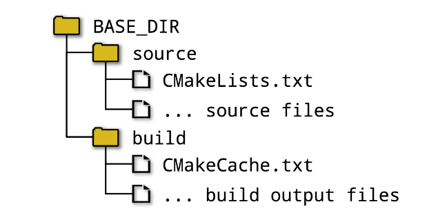
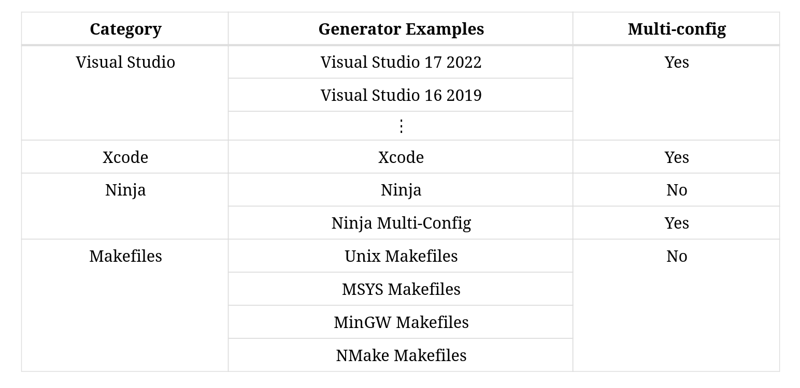
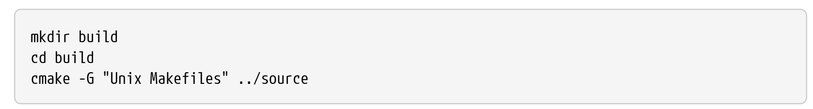
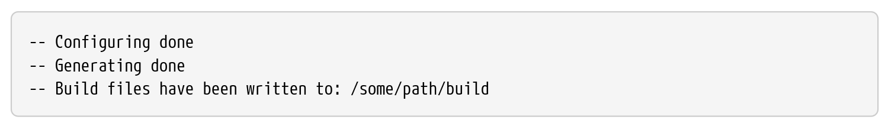
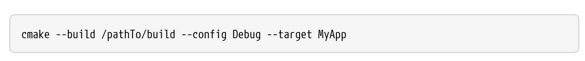
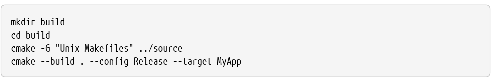

- CMake using a file called _CMakeLists.txt_ to define what should be built and how, what tests to run and what package(s) to create
- This file is a platform-independent description of the whole project, which CMake then turns into platform specific build tool project files
- A fundamental part of CMake is the concetp of a project having both a **source directory** and a **binary directory (build directory)**:
  - **Source directory** is where the _CMakeLists.txt_ file is located and the project's source files and all other files needed for the build are organized under that location. The source directory is frequently under version control with a tool like git, subversion, or similar
  - **Binary directory** is where everything produced by the build is created. CMake, the chosen build tool (e.g. make, Visual Studio, etc.), CTest and CPack will create various files within this directory and subdirectories below it. Executables, libraries, test output and packages are all created within the build directory. CMake also creates a special file called CMakeCache.txt in the build directory to store various information for reuse on subsequent runs. The binary directory is not intended to be put under version control
- There are essentially two approaches about the relationship of the build directory and the source directory:
  - **In-source builds** source and build directories to be the same. It's not a good way for managing the project
  - **Out-of-source builds** source and build directories to be different. It like the image below:

<i>Figure 1: Out-of-source builds</i>

 

- Once the choice of directory structure has been made, the developer runs CMake, which reads in the _CMakeLists.txt_ file and create project files in the build directory
- The developer selects the type of project file to be created by choosing a particular project file _generator_:
  
  
<i>Figure 2: A range of different generators are supported</i>

   
- The most basic way to run CMake is via the _cmake_ command line utility. For example:
  
  
<i>Figure 3: Running Cmake using command line</i>

   

  If -G option is omitted, CMake will choose a default generator type based on the host platform. From CMake 3.15 to later, this default can be overridden by setting the **CMAKE_GENERATOR** environment variable to the desired default instead
- A variety of information will be logged before CMake finishes with lines like the following upon success:
  
  
<i>Figure 4: Success running CMake log</i>

    
- At this point, with project files now available, the developer can use their selected build tool in the way to which they are accustomed. The build directory will contain the necessary project files which can be loaded into an IDE, read by command line tools, etc. Alternatively, _cmake_ can invoke the build tool on the developer's behalf like so:
  
  
<i>Figure 5: Running the build tool</i>

   

  - The --build option points to the build directory used by the CMake project generation step
  - For multi configuration generators, the --config option specifies which configuration to build, whereas single configuration generators will ignore the --config option and rely instead on information provided when the CMake project generation step was performed
  - The --target option can be used to tell the build tool what to build, or if omitted, the default target will be built. With CMake 3.15 or later, multiple targets can be listed after the --target option, separated by spaces
- A simple script for driving all the build process may be useful, it might look something like this:
  
  
<i>Figure 6: Basic Script Build</i>

   
