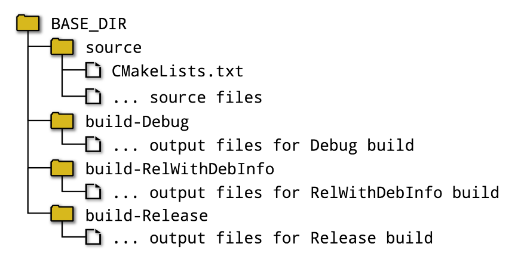

- The build type (also known as the build configuration or build scheme in some IDE tools) is a high level control which selects different sets of compiler and linker behavior
- The build type has potential to affect almost everything about the build in one way or another
- While it primarily has a direct effect on the compiler and linker behavior, it also has an effect on the directory structure used for the project
- This can in turn influence how a developer sets up their own local development environment, so the effects of the build type can be quite far-reaching
- Developers commonly think of builds as being one of two arrangements: debug or release
- For a debug build, compiler flags are used to enable the recording of information that debuggers can use to associate machine instructions with the source code.  Optimizations are frequently disabled in such builds so that the mapping from machine instruction to source code location is direct and easy to follow when stepping through program execution
- A release build, on the other hand, generally has full optimizations enabled and no debug information generated
- These are examples of what CMake refers to as the _build type_. While projects are able to define whatever build types they want, the default build types provided by CMake are usually sufficient for most projects:
  - **Debug**: With no optimizations and full debug information, this is commonly used during development and debugging, as it typically gives the fastest build times and the best interactive debugging experience
  - **Release**: This build type typically provides full optimizations for speed and no debug information, although some platforms may still generate debug symbols in certain circumstance. It is generally the build type used when building software for final production releases
  - **RelWithDebInfo**: This is somewhat of a compromise of the previous two. It aims to give performance close to a _release_ build, but still allow some level of debugging. Most optimizations for speed are typically applied, but most debug functionality is also enabled. This build type is therefore most useful when the performance of a Debug build is not acceptable even for a debugging session. Note that the default settings for RelWithDebInfo will diasble assertions
  - **MinSizeRel**: This build type is typically only used for constrained resource environments such as embedded devices. The code is optimized for size rather than speed and no debug information is created
- Each build type results in a different set of compiler and linker flags. It may also change other behaviors, such as altering which source files get compiled or what libraries to link to
- Single configuration generator:
  - Some, like **Makefiles** and **Ninja**, support only single build type per build directory
  - For these generators, the build type is chosen by setting the _**CMAKE_BUILD_TYPE**_ cache variable
  - For example, to configure and then build a project with Ninja, one might use commands like this:
  
    ```CMake
    cmake -G Ninja -DCMAKE_BUILD_TYPE:STRING=Debug ../source
    cmake --build .
    ```
  - Rather than switching between different build types in the same build directory, an alternative strategy is to set up separate build directories for each build type, all still using the same source. The directory structure might look something like this:
    
    <p align="center"><i> Figure 1: build type directory structure </p></i>

  - If frequently switching between build types, this arrangement avoids having to constantly recompile the same sources just because compiler flags change
  - It also allows a single configuration generator to effectively act like a multi configuration generator
- Multiple Configuration Generators:
  - Some generators, notably Xcode and Visual Studio, support multiple configurations in a single build directory
  - From CMake 3.17, the Ninja Multi-Config generator is also available
  - These multi-config generators ignore the **_CMAKE_BUILD_TYPE_** cache variable and instead require the developer to choose the build type within the IDE or with a command line option at build time. For example:
  
    ```CMAKE
    cmake -G Xcode ../source
    cmake --build . --config Debug
    ```
  - When building within the Xcode IDE, the build type is controlled by the build scheme, while within the Visual Studio IDE, the current solution configuration controls the build type. Both environments keep separate directories for the different build types, so switching between builds doesn’t cause constant rebuilds. In effect, the same thing is being done as the multiple build directory arrangement described above for single configuration generators, it’s just that the IDE is handling the directory structure on the developer’s behalf
  - For command-line builds, the Ninja Multi-Config generator has a little more flexibility compared to the other multi-config generators. The **_CMAKE_DEFAULT_BUILD_TYPE_** cache variable can be used to change the default configuration to use when no configuration is specified on the build command line