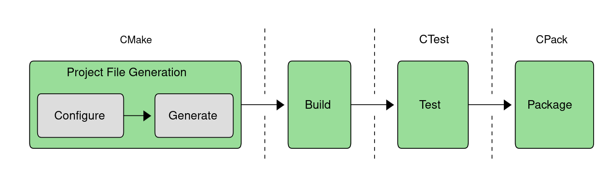

<i>Figure 1: Cmake Process</i>

 
- The fist stage takes a generic project description and genrerates platform-specific projects files suitable for use with the developer's regular build tool of choice (eg. make, Xcode, Visual Studio,etc)
- CMake suite of tools alse includes CTest and CPack for managing the later testing and packaging stages respectively
- The testing and packaging steps available simply as additional targets in the build