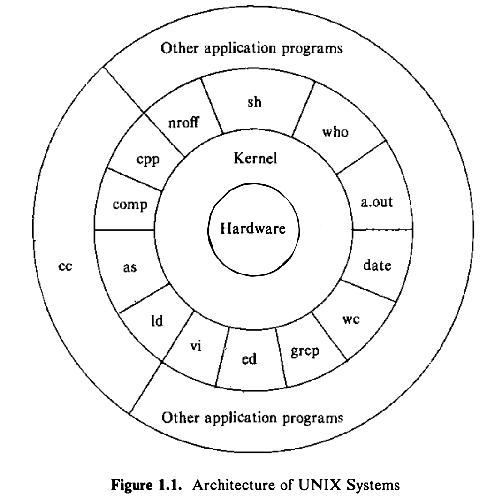

**1.2 System Structure**

Figure 1.1 depict the high-level architecture of the UNIX system:
- The hardware at the center of the diagram provides the operating system with basic services will be described in Section 1.5.
- The operating system interacts directly with the hardware, providing common services to programs and insualting them from hardware idiosyncrasises.
- Viewing the system as a set of layers, the operating system is commonly called the **_system kernel_**, or just the _**kernel**_, emphasizing its isolation from user programs.
- Because programs are independent of the underlying hardware, it is easy to move them between UNIX systems running on different hardware if the programs do not make assumptions about the underlying hardware. (For instance, programs that assume the size of a machine word are more difficult to move to other machines than programs that do not make this assumption)
- Programs such as the shell and editors (ed and vi) shown in the outer layers interact with the kernel by invoking a well defined set of **_system calls_**.
- **The system calls instruct the kernel to do various operations for the calling program and exchange data between the kernel and the program.**
- Other application programs can build on top of lower-level programs, hence the existence of the outermost layer in the figure. (For example, the standard
C compiler, cc, is in the outermost layer of the figure: it invokes a C preprocessor,two-pass compiler, assembler, and loader (link-editor), all separate lower-level
programs.)
- Although the figure depicts a two-level hierarchy of application programs, users can extend the hierarchy to whatever levels are appropriate.
- **Indeed, the style of programming favored by the Unix system encourages the combination of existing programs to accomplish a task**
- Many application subsystems and programs that provide a high-level view of the system such as shell, editors, SCCS (Source Code Control System), and document preparation packages use low-level services ultimately provided by the kernel, and they avail themselves of these services via the set of system calls.
- There are about 64 system calls in System V. They have simple options that make them easy to use but provide the user with a lot of power. The set of system calls and the internal algorithms that implement them form the body of the kernel.
- The study of the UNIX operating system presented in this book reduces to a detailed study and analysis of the system calls and their interaction with one another.
- **In short, the kernel provides the
services upon which all application programs in the UNIX system rely, and it defines those services.**