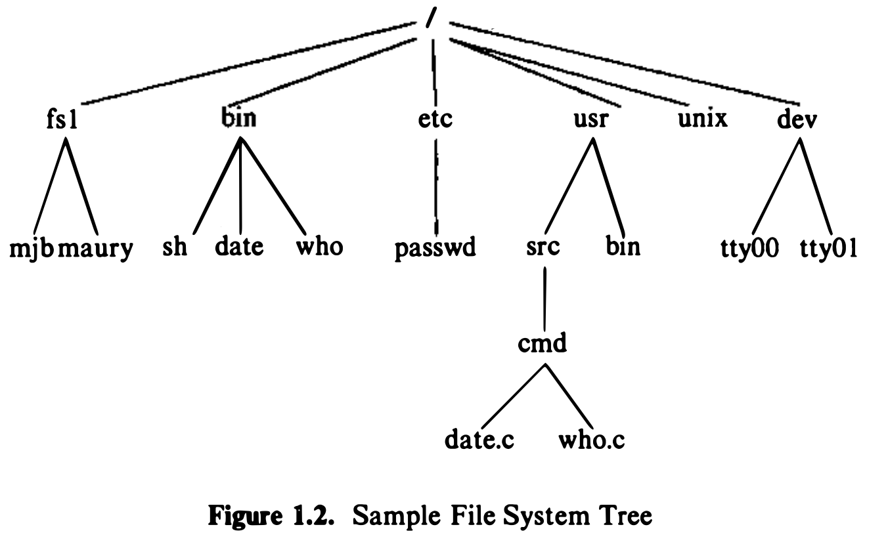

**1.3 User Perspective**

**Overview:** This section briefly reviews high-level features of the UNIX system such as the file system, the processing environment, and build block primitives (for example, _pipes_)

**1.3.1 The File System:** 
The UNIX file system is characterized by: 
- a hirerarchical structure,
- consistent treatment of file data,
- the ability to create and delete files,
- dynamic growth of files,
- the protection of file data,
- **the treatment of peripheral devices (such as terminals and tape units) as files**.

File system organization:
- The file system is organized as a tree with a single root node called root (written"/")
- Every non-leaf node of the file system structure is a directory of files, and files at the leaf nodes of the tree are either directories, regular files , or special device files

    

- A full file path name starts with a slash character and specifies a ·file that can be found by starting at the file system root and traversing the file/ tree, following the branches that lead to successive component names of the path name
- A path name does not have to start from root but can be designated relative to the current directory of an executing process, by omitting the initial slash in the path name

Consitent treatment of file data:
- Programs in the UNIX system have no knowledge of the internal format in
which the kernel stores file data, treating the data as an unformatted stream of bytes
- Programs may interpret the byte stream as they wish, but the interpretation
has no bearing on how the operating system stores the data 
- Thus, the syntax of accessing the data in a file is defined by the system and is identical for all programs, but the semantics of the data are imposed by the program
- _For example_: the text formatting program troff expects to find "new-line" characters at the end of each line of text, and the system accounting program acctcom expects to find fixed length records. Both programs use the same system services to access the data in the file as a byte stream, and internally, they parse the stream into a
suitable format
- Directories are like regular files in this respect; the system treats the data in a directory as a byte stream, but the data contains the names of the files in the directory in a predictable format so that the operating system and programs such as _ls_ (list the names and attributes of files) can discover the files in a directory

Access permission:
- Permission to access a file is controlled by _**access permissions**_ associated with the file
- Access permissions can be set independently to control read, write, and
execute permission for three classes of users: the file owner, a file group, and
everyone else
- Users may create files if directory access permissions allow it
- The newly created files are leaf nodes of the file system directory structure

Device files in the user view:
- **To the user, the UNIX system treats devices as if they were files**
- Devices, designated by special device files, occupy node positions in the file system directory structure
- Programs access **devices** with the same syntax they use when accessing regular files; the semantics of reading and writing devices are to a large degree the same as reading and writing regular files
- Devices are protected in the same way
that regular files are protected: by proper setting of their (file) access permissions
- Because device names look like the names of regular files and because the same operations work for devices and regular files, **most programs do not have to know internally the types of files they manipulate**